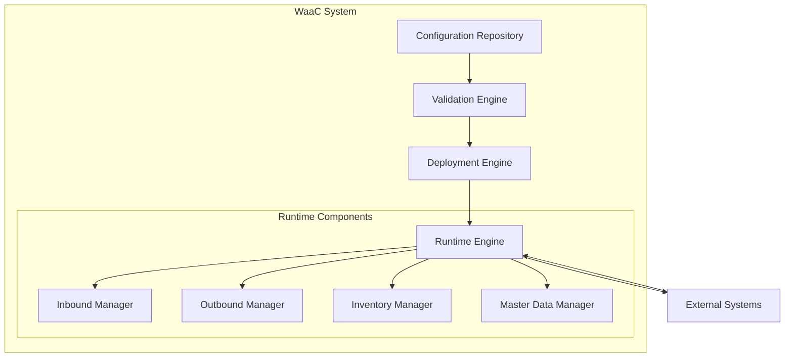
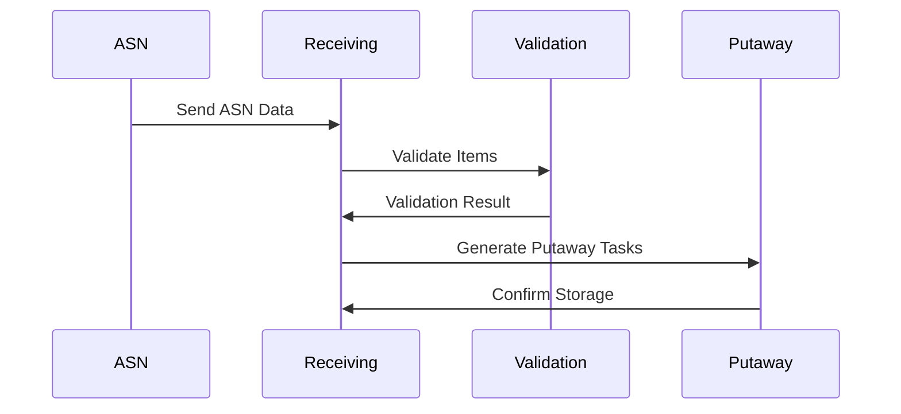
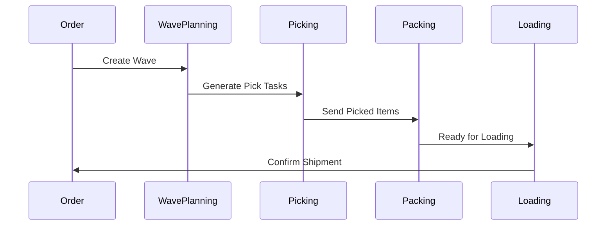
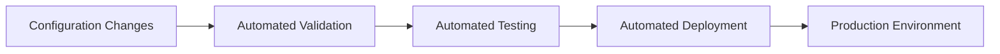
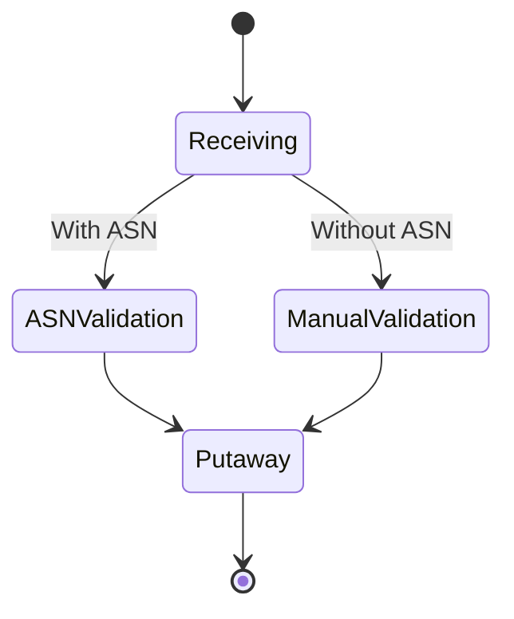
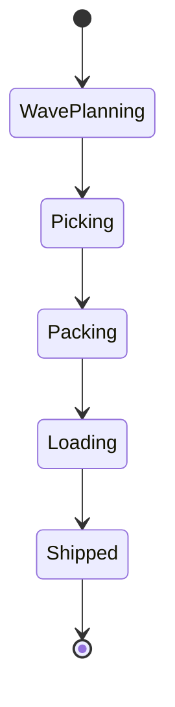
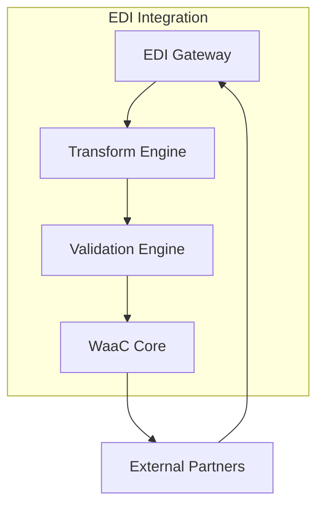

# WaaC - Warehouse as a Code: Rivoluzionare la gestione del magazzino

## Introduzione

Il concetto di "Warehouse as a Code" (WaaC) rappresenta un approccio innovativo alla gestione del magazzino, applicando i principi dell'Infrastructure as Code (IaC) al dominio della logistica. Questo articolo esplora come implementare un sistema WMS utilizzando questo paradigma, analizzandone vantaggi e implementazione pratica.

## L'architettura WaaC

L'architettura WaaC si basa su tre pilastri fondamentali:
1. **Configurazione Dichiarativa**
2. **Automazione dei Processi**
3. **Versionamento e Controllo**

### Struttura del Sistema



## Componenti Principali

### 1. Configuration Repository

Il cuore del sistema WaaC è il repository di configurazione, dove viene definita l'intera struttura del magazzino in formato YAML:

```yaml
warehouse:
  version: '1.0'
  name: 'main-warehouse'
  layout:
    zones:
      - name: 'inbound'
        type: 'receiving'
      - name: 'storage'
        type: 'storage'
```

### 2. Flussi Operativi

#### Inbound Flow



#### Outbound Flow



## Vantaggi del WaaC

### 1. Versionamento e Tracciabilità

Il WaaC permette di:
- Mantenere uno storico completo delle configurazioni
- Tracciare ogni modifica al sistema
- Ripristinare configurazioni precedenti in caso di problemi

### 2. Automazione e Standardizzazione



### 3. Scalabilità e Replicabilità

- **Multi-warehouse Support**: La stessa configurazione può essere facilmente replicata su più magazzini
- **Environment Parity**: Garantisce consistenza tra ambienti di sviluppo, test e produzione
- **Rapid Scaling**: Facilita l'aggiunta di nuove funzionalità o l'espansione del sistema

## Implementazione dei Requisiti

### 1. Gestione Inbound



### 2. Gestione Outbound



## Integrazione con Sistemi Esterni

### EDI Integration



## Best Practices e Linee Guida

1. **Versionamento**
   - Utilizzare semantic versioning per le configurazioni
   - Documentare ogni modifica significativa
   - Mantenere un changelog dettagliato

2. **Testing**
   - Implementare test automatizzati per ogni configurazione
   - Validare le modifiche in ambiente di staging
   - Eseguire test di carico per verificare le performance

3. **Sicurezza**
   - Implementare controlli di accesso granulari
   - Crittografare dati sensibili
   - Mantenere audit log completi

## Conclusioni

Il WaaC rappresenta un'evoluzione significativa nella gestione del magazzino, portando i benefici dell'Infrastructure as Code nel mondo della logistica. Questo approccio non solo migliora l'efficienza operativa, ma rende anche il sistema più manutenibile, scalabile e affidabile.

La combinazione di configurazione dichiarativa, automazione e versionamento offre un controllo senza precedenti sulle operazioni di magazzino, riducendo gli errori e migliorando la velocità di implementazione delle modifiche.

### Prossimi Passi

Per iniziare con WaaC, si consiglia di:
1. Definire la struttura base del magazzino in YAML
2. Implementare i validatori di configurazione
3. Creare pipeline di CI/CD per il deployment
4. Sviluppare strumenti CLI per la gestione
5. Implementare monitoring e alerting

Il futuro della gestione del magazzino è nel codice, e WaaC è la chiave per sbloccare questo potenziale.