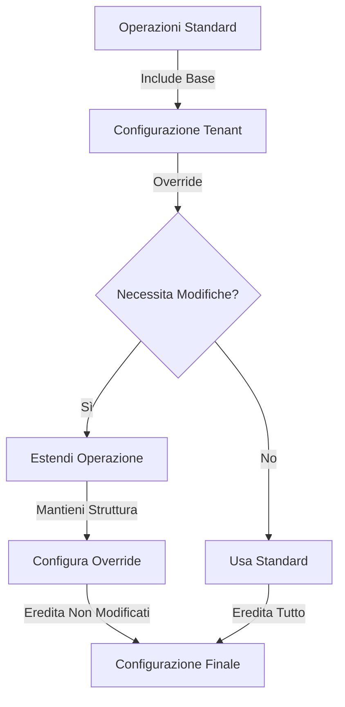
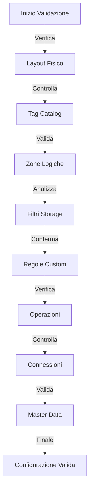

# Guida Dettagliata alla Compilazione degli YAML WaaC

Questa guida ti accompagnerà passo dopo passo nella compilazione dei file YAML per la configurazione del Warehouse as a Code (WaaC). Vedremo insieme come strutturare ogni componente, con esempi pratici e spiegazioni dettagliate.

## Schema di Configurazione

```
waac/
├── main.yaml                      # File principale di configurazione
├── waac-physical_layout.yaml      # Definizione layout fisico
├── waac-validation-rules.yaml     # Regole di validazione
├── waac-standard-operations.yaml  # Operazioni standard
└── tenants/                       # Configurazioni specifiche per tenant
    ├── fast_fashion.yaml
    └── industrial_pro.yaml
```

## Flussi di Configurazione

### Override delle Operazioni Standard



### Processo di Validazione Configurazione



## 1. Configurazione del Layout Fisico

Partiamo dalle fondamenta: il layout fisico del magazzino. Questo è il punto di partenza cruciale perché definisce la struttura reale del tuo magazzino.

### Il Catalogo dei Tag: La Tua Libreria di Caratteristiche
Pensa al catalogo dei tag come a una libreria di caratteristiche che puoi assegnare alle diverse aree del tuo magazzino. Ecco un esempio pratico:

```yaml
tag_catalog:
  storage_type:
    - name: 'euro_pallet'
      description: 'Posizione per pallet EUR standard'
      dimensions: 
        length: 1200  # mm
        width: 800   # mm
      capabilities:
        max_weight: 1500  # kg
        stackable: true
    
    - name: 'shelf_light'
      description: 'Scaffalatura leggera per scatole'
      capabilities:
        max_weight: 100   # kg per ripiano
        adjustable: true
  
  access:
    - name: 'easy_reach'
      description: 'Accessibile manualmente senza attrezzature'
      max_height: 1800    # mm
    
    - name: 'forklift_required'
      description: 'Richiede muletto per accesso'
      equipment: ['forklift']

  environment:
    - name: 'temperature_controlled'
      description: 'Area a temperatura controllata'
      parameters:
        min_temp: 15     # °C
        max_temp: 25     # °C
        humidity: '40-60' # %
```

Ogni tag nel catalogo rappresenta una caratteristica specifica del tuo magazzino. Vediamo nel dettaglio come definirli:

1. **Storage Type (Tipo di Stoccaggio)**:
   - Definisci ogni tipo di posizione di stoccaggio
   - Includi SEMPRE le dimensioni fisiche
   - Specifica le capacità (peso massimo, impilabilità)
   - Esempio pratico: Per un'area di stoccaggio pallet, dovrai specificare se è per euro-pallet o pallet industriali

2. **Access (Accessibilità)**:
   - Descrivi come si accede alla posizione
   - Specifica l'attrezzatura necessaria
   - Includi limiti di altezza per sicurezza
   - Esempio pratico: Un'area "easy_reach" potrebbe essere per il picking manuale frequente

3. **Environment (Ambiente)**:
   - Definisci condizioni ambientali specifiche
   - Includi parametri misurabili
   - Specifica ranges accettabili
   - Esempio pratico: Per prodotti sensibili alla temperatura, definisci i limiti precisi

## 2. Configurazione delle Zone

Ora che abbiamo definito le caratteristiche base, vediamo come organizzare il magazzino in zone logiche. Questa è la parte dove il WaaC diventa davvero potente, permettendoti di creare layout personalizzati per ogni tenant.

### Come Definire le Zone: Un Approccio Pratico
Prendiamo un esempio reale di un'azienda di moda che necessita di diverse zone per diversi tipi di prodotti:

```yaml
logical_layout:
  zones:
    fast_fashion:
      description: 'Zona prodotti fast fashion ad alta rotazione'
      storage_filters:
        location:
          include: ['front_area', 'ground_level']
          exclude: ['restricted', 'high_rack']
        access:
          include: ['easy_reach']
          exclude: ['forklift_required']
        environment:
          include: ['dust_free']
      
      optimization:
        picking_priority: 1
        restocking_threshold: 80  # % di occupazione
      
      dynamic_allocation:
        enabled: true
        expansion_zones: ['buffer_zone', 'seasonal_overflow']
    
    seasonal_storage:
      description: 'Stoccaggio collezioni stagionali'
      storage_filters:
        environment:
          include: ['temperature_controlled', 'humidity_controlled']
        storage_type:
          include: ['rack_system', 'bulk_storage']
      
      seasonal_rules:
        rotation_schedule:
          - condition: 'end_of_season'
            action: 'move_to_clearance'
          - condition: 'new_season_incoming'
            action: 'prepare_prime_locations'
```

Analizziamo insieme come strutturare le zone:

1. **Identificazione della Zona**
   - Dai un nome chiaro e descrittivo
   - Aggiungi una descrizione dettagliata
   - Esempio: Una zona "fast_fashion" per prodotti ad alta rotazione

2. **Filtri di Storage**
   - `include`: Tag che DEVE avere la location
   - `exclude`: Tag che NON DEVE avere
   - Combina più tipi di filtri per maggiore precisione
   - Esempio pratico: Per prodotti delicati, includi 'dust_free' e escludi 'high_rack'

3. **Regole di Ottimizzazione**
   - Definisci priorità di picking
   - Imposta soglie di restock
   - Configura regole di espansione
   - Esempio: Imposta alta priorità per zone vicine all'area spedizioni

### Regole Custom: Personalizzazione Avanzata

Le regole custom ti permettono di definire logiche specifiche per il tuo business. Ecco alcuni esempi pratici:

```yaml
custom_rules:
  - type: 'distance'
    name: 'Limite Distanza Spedizioni'
    max_distance_from_shipping: 50  # metri
    priority_zones: ['express_shipping', 'priority_orders']
    exceptions:
      - condition: 'item.weight > 1000'
        max_distance: 100  # metri per items pesanti
  
  - type: 'product_affinity'
    name: 'Raggruppamento Collezione'
    group_by: ['collection', 'color']
    max_separation: 3  # corridoi
    priority: 'high'
  
  - type: 'seasonal_rotation'
    name: 'Rotazione Stagionale'
    schedule:
      - season: 'SS24'
        start_date: '2024-03-01'
        end_date: '2024-08-31'
        priority_zones: ['seasonal_prime']
```

Alcuni esempi di utilizzo pratico:

1. **Regola di Distanza**
   - Utile per ottimizzare i tempi di picking
   - Considera eccezioni per prodotti speciali
   - Esempio: Prodotti express sempre vicini all'area spedizioni

2. **Affinità Prodotti**
   - Mantieni prodotti correlati vicini
   - Facilita il picking di ordini multi-item
   - Esempio: Stessa collezione nello stesso corridoio

3. **Rotazione Stagionale**
   - Gestisci automaticamente il cambio stagione
   - Pianifica in anticipo i movimenti
   - Esempio: Sposta automaticamente la collezione estiva in prime location a marzo

## 3. Configurazione delle Operazioni

Il sistema di override delle operazioni è uno dei punti di forza del WaaC. Ti permette di personalizzare le operazioni standard mantenendo la compatibilità con il sistema base.

### Come Funziona l'Override: Una Guida Pratica
Immagina le operazioni standard come una ricetta base che puoi modificare per le tue esigenze specifiche. Ecco un esempio completo:

```yaml
operations:
  # Override completo dell'operazione inbound
  inbound: !include waac-standard-operations.yaml#operations.inbound
    receiving:
      # Modifica controlli qualità
      quality_check:
        quantity_tolerance_percentage: 1  # Più stringente dello standard
        required_checks:
          - barcode_scan
          - dimension_verify
          - quality_inspection
        
        # Aggiungi controlli specifici
        fashion_specific_checks:
          - color_matching
          - size_verification
          - fabric_quality
      
      # Personalizza processo di stoccaggio
      putaway:
        strategy: 'optimize_for_picking'
        rules:
          - name: 'collection_grouping'
            priority: 1
            conditions:
              - 'item.collection == current_collection'
              - 'item.season == active_season'
          
          - name: 'size_sequence'
            priority: 2
            conditions:
              - 'maintain_size_sequence'
              - 'group_by_style'

  # Estensione parziale dell'outbound
  outbound: !include waac-standard-operations.yaml#operations.outbound
    picking:
      wave_creation:
        max_orders: 50
        grouping_rules:
          - 'by_collection'
          - 'by_carrier'
      
      methods:
        standard: ['rf_picking', 'paper_list']
        special:
          flash_sale:
            type: 'zone_picking'
            max_pickers_per_zone: 3
```

Vediamo come gestire gli override efficacemente:

1. **Override Totale vs Parziale**
   - Override Totale: Ridefinisci completamente un'operazione
   - Override Parziale: Modifica solo alcuni parametri
   - Esempio pratico: Puoi mantenere il processo standard di picking ma modificare solo la dimensione delle wave

2. **Ereditarietà delle Configurazioni**
   - I parametri non specificati ereditano i valori standard
   - Puoi estendere aggiungendo nuovi parametri
   - Esempio: Aggiungi controlli specifici per il fashion mantenendo i controlli base

3. **Best Practices per gli Override**
   - Documenta sempre il motivo dell'override
   - Mantieni la struttura il più simile possibile allo standard
   - Testa accuratamente le modifiche
   - Esempio: Se modifichi la tolleranza di quantità, specifica il motivo nei commenti

### Creazione di Nuove Operazioni Personalizzate

Oltre a modificare le operazioni standard, puoi creare operazioni completamente nuove per esigenze specifiche. Ecco un esempio nel settore fashion:

```yaml
operations:
  # Operazioni specifiche per il fashion
  fashion_specific:
    # Gestione cambio stagione
    seasonal_management:
      enabled: true
      rotation_schedule:
        - phase: 'pre_season'
          timing: '-30d before season_start'
          actions:
            - 'prepare_prime_locations'
            - 'plan_initial_allocation'
        
        - phase: 'mid_season'
          timing: '45d after season_start'
          actions:
            - 'analyze_sales_performance'
            - 'rebalance_stock'
        
        - phase: 'end_season'
          timing: '-15d before season_end'
          actions:
            - 'prepare_clearance_areas'
            - 'plan_stock_movement'
      
      automation_rules:
        - trigger: 'low_stock'
          condition: 'stock_level < 20% AND sales_rate > threshold'
          actions:
            - 'consolidate_locations'
            - 'release_prime_space'
```

Consigli per creare nuove operazioni:

1. **Struttura Chiara**
   - Organizza logicamente le fasi
   - Definisci trigger e azioni
   - Esempio: Dividi il cambio stagione in fasi precise

2. **Automazione**
   - Imposta regole automatiche
   - Definisci condizioni chiare
   - Esempio: Automatizza la consolidazione dello stock in base alle vendite

3. **Integrazione**
   - Assicurati che le nuove operazioni si integrino con quelle standard
   - Prevedi punti di sincronizzazione
   - Esempio: Coordina il cambio stagione con le operazioni di inbound

## 4. Configurazione delle Connessioni

La corretta configurazione delle connessioni è fondamentale per l'integrazione del WaaC con i sistemi esterni. Vediamo come configurare diversi tipi di connessione in modo sicuro ed efficiente.

### Configurazione FTP: Gestione Sicura dei File
Esempio completo di configurazione FTP per scambio dati:

```yaml
connections:
  main_ftp:
    type: 'ftp'
    security: 'sftp'
    host: 'ftp.fashion-company.com'
    port: 22
    credentials:
      username: '${ENV_FTP_USER}'
      password: '${ENV_FTP_PASS}'
      key_file: '${ENV_SSH_KEY_PATH}'
    
    directories:
      inbound:
        path: '/WAAC/IN'
        processing:
          - pattern: 'orders_*.xml'
            action: 'process_orders'
            archive: true
          - pattern: 'inventory_*.csv'
            action: 'update_stock'
            validation: 'strict'
      
      outbound:
        path: '/WAAC/OUT'
        naming_convention: '${date}_${type}_${tenant}.${ext}'
        retention: '30d'
    
    monitoring:
      check_interval: 300  # secondi
      alerts:
        - condition: 'connection_failed'
          notify: ['tech_team']
        - condition: 'file_processing_error'
          notify: ['ops_team', 'tech_team']
```

Elementi chiave da configurare:

1. **Sicurezza**
   - Usa SEMPRE SFTP invece di FTP
   - Implementa autenticazione a chiave dove possibile
   - Esempio: Configura sia password che chiave SSH per maggiore sicurezza

2. **Struttura Directory**
   - Organizza i file per tipo e funzione
   - Implementa regole di archiviazione
   - Esempio: Separa ordini e inventario in cartelle diverse

3. **Monitoraggio**
   - Configura controlli periodici
   - Imposta notifiche per errori
   - Esempio: Notifica il team tecnico per problemi di connessione

### Configurazione API: Integrazione Real-time

Esempio di configurazione API completa:

```yaml
connections:
  rest_api:
    type: 'rest'
    base_url: 'https://api.fashion-company.com/v1'
    auth:
      type: 'oauth2'
      client_id: '${ENV_API_CLIENT}'
      client_secret: '${ENV_API_SECRET}'
      token_url: 'https://auth.fashion-company.com/token'
      scopes: ['inventory.read', 'orders.write']
    
    endpoints:
      inventory:
        method: 'GET'
        path: '/inventory/status'
        rate_limit: 100  # richieste/minuto
        retry:
          max_attempts: 3
          backoff: 'exponential'
      
      orders:
        method: 'POST'
        path: '/orders/create'
        validation:
          schema: 'order_schema.json'
          required_fields: ['order_id', 'items']
    
    error_handling:
      retry_codes: [500, 502, 503]
      alert_on: [400, 401, 403]
      circuit_breaker:
        threshold: 5
        timeout: 60  # secondi
```

Considerazioni importanti:

1. **Autenticazione**
   - Implementa OAuth2 per sicurezza
   - Gestisci correttamente i token
   - Esempio: Configura refresh automatico dei token

2. **Rate Limiting**
   - Rispetta i limiti dell'API
   - Implementa retry intelligenti
   - Esempio: Usa backoff esponenziale per i retry

3. **Gestione Errori**
   - Configura circuit breaker
   - Definisci strategie di retry
   - Esempio: Interrompi le chiamate dopo 5 errori consecutivi

## 5. Master Data

La configurazione del Master Data è cruciale per mantenere dati coerenti e strutturati. Vediamo come organizzare gli attributi per diversi tipi di dati.

### Definizione Attributi: Struttura Dati Flessibile
Esempio completo di configurazione Master Data per un'azienda di moda:

```yaml
master_data:
  items:
    attributes:
      # Attributi Base
      - name: 'sku'
        type: 'string'
        unique: true
        required: true
        validation: '^[A-Z]{2}-\d{6}$'  # Formato: XX-123456
      
      # Attributi Fashion
      - name: 'style'
        type: 'composite'
        components:
          collection: 'string'
          season: 
            type: 'enum'
            values: ['SS24', 'FW24', 'SS25']
          category:
            type: 'hierarchical'
            levels: ['department', 'category', 'subcategory']
      
      # Attributi Fisici
      - name: 'physical'
        type: 'object'
        properties:
          dimensions:
            type: 'object'
            properties:
              length: 'numeric'
              width: 'numeric'
              height: 'numeric'
            unit: 'mm'
            validation:
              min: 1
              max: 3000
          
          weight:
            type: 'numeric'
            unit: 'g'
            validation:
              min: 0
              max: 10000
      
      # Attributi di Stock
      - name: 'stock'
        type: 'dynamic'
        sources:
          quantity:
            type: 'numeric'
            update: 'realtime'
          location:
            type: 'reference'
            entity: 'warehouse_locations'
          status:
            type: 'enum'
            values: ['available', 'reserved', 'damaged']
            track_history: true
```

Vediamo come strutturare diversi tipi di attributi:

1. **Attributi Base**
   - Usa identificatori univoci
   - Implementa validazione formato
   - Esempio: SKU con formato specifico

2. **Attributi Composti**
   - Combina più informazioni correlate
   - Usa gerarchie quando necessario
   - Esempio: Style che include collezione e stagione

3. **Attributi Fisici**
   - Specifica sempre le unità di misura
   - Imposta range di validazione
   - Esempio: Dimensioni con limiti min/max

4. **Attributi Dinamici**
   - Configura aggiornamenti in tempo reale
   - Traccia la storia dei cambiamenti
   - Esempio: Stato dello stock con storico

## 6. Regole di Validazione

Le regole di validazione sono fondamentali per mantenere l'integrità dei dati e delle operazioni. Vediamo come implementare un sistema di validazione robusto.

### Definizione Regole: Garantire la Qualità dei Dati
Esempio completo di regole di validazione:

```yaml
validation_rules:
  # Regole Fisiche
  physical_constraints:
    - name: 'dimension_check'
      scope: 'putaway'
      condition: |
        item.dimensions.height <= location.max_height AND
        item.dimensions.width <= location.max_width AND
        item.dimensions.length <= location.max_length
      error_message: 'Dimensioni item non compatibili con location'
      severity: 'error'
      
    - name: 'weight_distribution'
      scope: 'putaway'
      condition: |
        (location.current_weight + item.weight) <= location.max_weight AND
        location.weight_distribution_even
      error_message: 'Violazione limiti peso o distribuzione non bilanciata'
      severity: 'warning'
  
  # Regole Business
  business_rules:
    - name: 'season_compatibility'
      scope: ['putaway', 'move']
      condition: |
        WHEN item.type == 'fashion'
        THEN location.zone.season == item.season
        OR location.zone.type == 'clearance'
      error_message: 'Item non compatibile con zona stagionale'
      
    - name: 'collection_grouping'
      scope: 'putaway'
      condition: |
        COUNT(
          location.nearby_locations
          .filter(l => l.items.collection == item.collection)
        ) >= 3
      error_message: 'Violazione raggruppamento collezione'
      priority: 'high'
  
  # Regole Operative
  operational_rules:
    - name: 'picking_efficiency'
      scope: 'move'
      condition: |
        WHEN item.pick_frequency == 'high'
        THEN location.distance_from_shipping <= 50
      error_message: 'Location troppo distante per item ad alta rotazione'
      
    - name: 'storage_optimization'
      scope: 'putaway'
      condition: |
        location.utilization_after_putaway <= 85%
      error_message: 'Superata soglia ottimale utilizzo location'
      severity: 'warning'
```

Elementi chiave nella definizione delle regole:

1. **Struttura della Regola**
   - Nome descrittivo
   - Scope di applicazione
   - Condizione chiara
   - Messaggio d'errore informativo
   - Esempio: Regola dimensioni con tutti i controlli necessari

2. **Tipi di Regole**
   - Vincoli fisici
   - Regole di business
   - Ottimizzazioni operative
   - Esempio: Separare regole per peso da regole per stagionalità

3. **Gestione Errori**
   -
```yaml
validation_rules:
  - name: 'check_dimensions'
    condition: 'item.dimensions.height <= location.max_height'
    error_message: 'Altezza item eccede limite location'
  
  - name: 'check_weight'
    condition: 'item.weight <= location.max_weight'
    error_message: 'Peso item eccede capacità location'
```
**Spiegazione**:
- `name`: Identificativo univoco della regola
- `condition`: Espressione logica da valutare
- `error_message`: Messaggio in caso di violazione

## Note Importanti per la Compilazione

1. **Ordine di Compilazione**:
   - Inizia dal layout fisico
   - Configura le regole di validazione
   - Definisci le operazioni standard
   - Personalizza per ogni tenant

2. **Test e Validazione**:
   - Verifica la sintassi YAML
   - Controlla la presenza di tutti i file inclusi
   - Valida le espressioni nelle regole
   - Testa ogni override separatamente

3. **Gestione Versioni**:
   - Documenta ogni modifica
   - Mantieni backup delle configurazioni
   - Usa il controllo versione

4. **Sicurezza**:
   - Mai committare credenziali
   - Usa sempre variabili d'ambiente
   - Limita gli accessi ai file sensibili
